# Auto Agents - Workflow Architecture

A fully autonomous agentic **Text-to-SQL** system. Users ask natural language questions, and a multi-agent LangGraph pipeline researches the schema, writes SQL, validates it, executes against SQL Server (MSSQL), and presents results with insights and optional interactive dashboards.

**Monorepo structure:**

| Package | Stack | Module System |
|---------|-------|---------------|
| `server/` | Express.js + LangGraph + LangChain | CommonJS (Node 18+) |
| `client/` | React 19 + Vite + Tailwind CSS v4 | ESM |

---

## 1. High-Level System Architecture

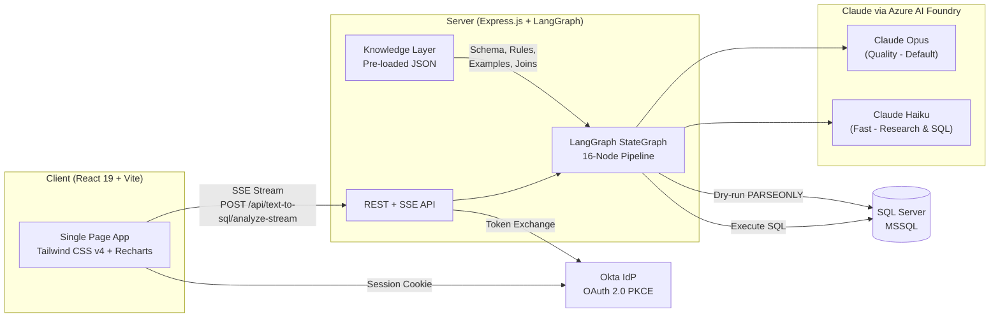

---

## 2. Server Middleware & Startup

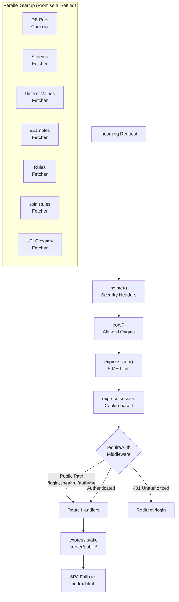

**API Endpoints:**

| Method | Path | Purpose |
|--------|------|---------|
| `POST` | `/api/text-to-sql/analyze-stream` | SSE streaming query processing |
| `POST` | `/api/text-to-sql/analyze` | Batch query processing |
| `POST` | `/api/text-to-sql/dashboard-data` | Paginated data + slicer values |
| `GET` | `/api/text-to-sql/history/:threadId` | LangGraph checkpoint history |
| `GET` | `/api/health` | Health check (server, DB, LLM) |
| `GET` | `/api/impersonate/search` | RLS impersonation user search |
| `GET` | `/api/auth/me` | Current user session check |

---

## 3. Complete LangGraph Workflow

The core pipeline is a LangGraph `StateGraph` with **16 nodes** and conditional routing. This is the master diagram of the entire agent workflow.

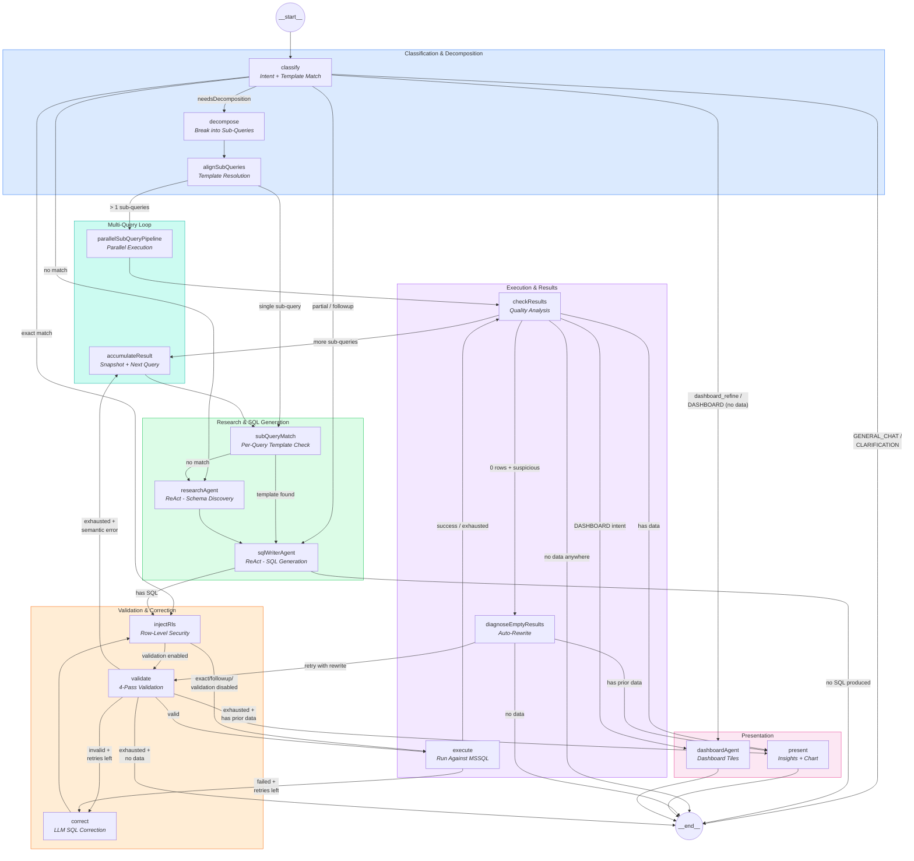

---

## 4. Classification & Routing Logic

The `classify` node determines intent and match type, then routes to the appropriate path. This is the entry-point decision tree.

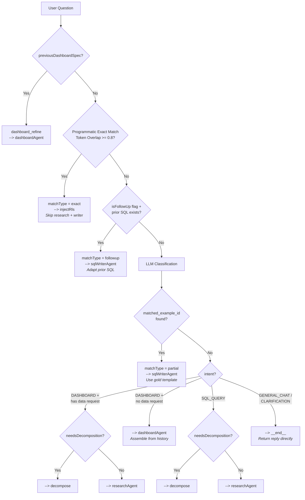

**Match Types:**

| Match Type | Skip Research? | Skip Writer? | Description |
|------------|---------------|-------------|-------------|
| `exact` | Yes | Yes | Token overlap >= 0.8 with gold example |
| `partial` | Yes | No | LLM matched to a gold example ID |
| `followup` | Yes | No | Adapts prior SQL from conversation |
| `dashboard_refine` | Yes | Yes | Modifies existing dashboard spec |
| `none` | No | No | Full research + write pipeline |

---

## 5. Multi-Query Decomposition & Parallel Pipeline

Complex questions are broken into sub-queries (up to `MAX_SUB_QUERIES = 4`) and executed in parallel.

### Decomposition Flow

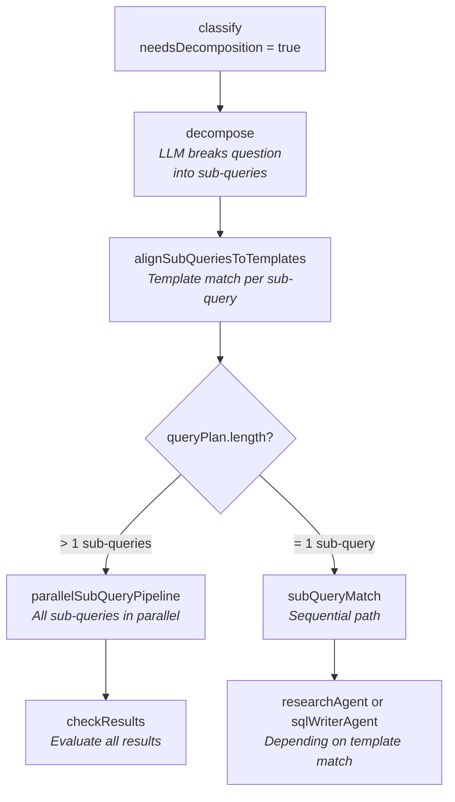

### Inside the Parallel Pipeline

Each sub-query runs through a mini-pipeline concurrently. Failed queries get one correction pass.

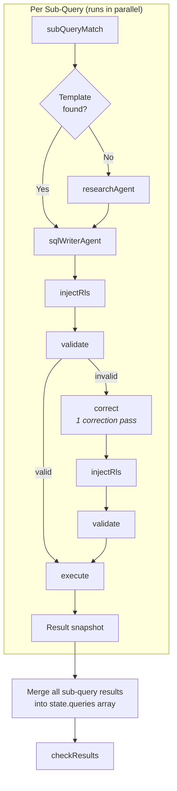

### Parallel Execution Timeline

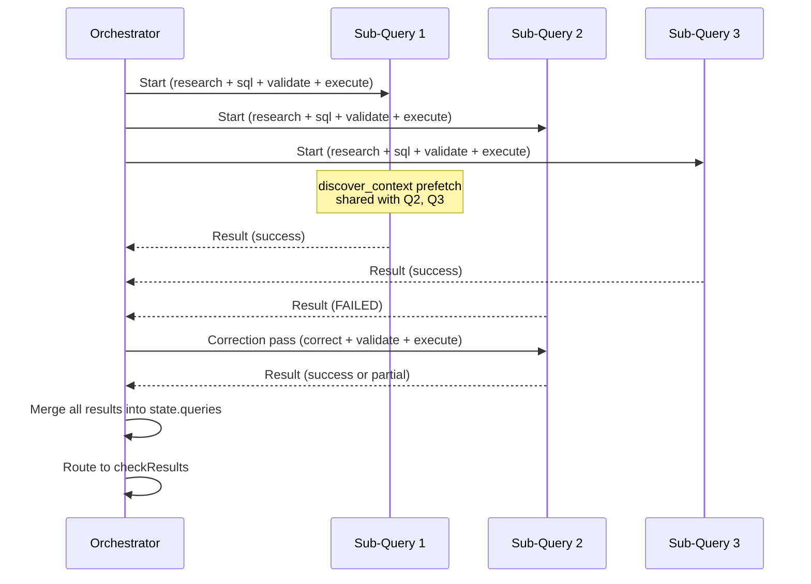

**Key constants:**
- `MAX_SUB_QUERIES = 4`
- `PARALLEL_CORRECTION_ROUNDS = 1`
- `SUB_QUERY_MATCH_THRESHOLD = 0.4`

---

## 6. Validation Pipeline

Four sequential validation passes with short-circuit on failure. The semantic (LLM) pass only runs if all prior passes succeed — saving LLM cost.

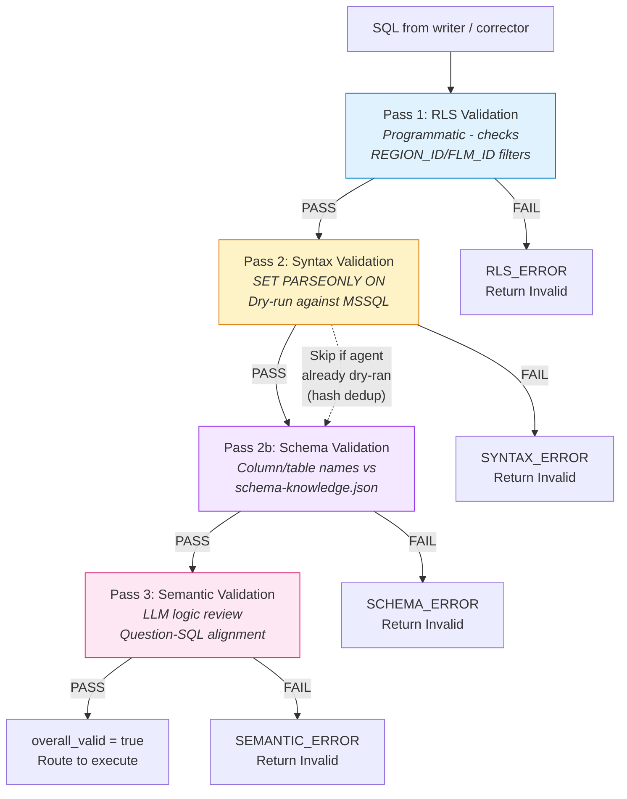

**Validation sources:**

| Pass | Type | Source | Speed |
|------|------|--------|-------|
| RLS | Programmatic | `rlsValidator.js` | < 1ms |
| Syntax | DB Dry-run | `syntaxValidator.js` (PARSEONLY) | ~50ms |
| Schema | Deterministic | `schemaValidator.js` vs JSON | < 5ms |
| Semantic | LLM | `semanticValidator.js` (Opus) | ~3-5s |

---

## 7. Correction Loop

When validation fails and correction attempts remain, the SQL is rewritten by the LLM and re-validated.

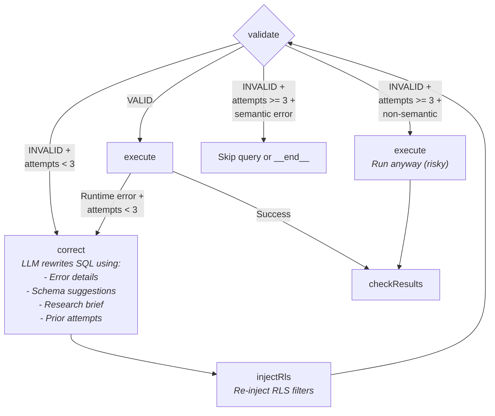

**Correction strategies by error type:**

| Error Type | Strategy |
|------------|----------|
| `SYNTAX_ERROR` | Fix SQL syntax using error message |
| `SCHEMA_ERROR` | Suggest valid columns/tables via `suggestColumnsForInvalidName()` |
| `SEMANTIC_ERROR` | Rewrite logic (time scope, join scope, entity scope, metric scope) |
| `RLS_ERROR` | Re-inject required security filters |
| `EXECUTION_ERROR` | Fix runtime issues using DB error output |

**Key constant:** `MAX_CORRECTION_ROUNDS = 3`

---

## 8. Agent Tool Architecture

Two ReAct agents power the core pipeline, each with specialized tool sets.

```mermaid
graph LR
    subgraph RA["Research Agent"]
        direction TB
        RA_LABEL["Phase 1: Haiku (Discovery)<br/>Phase 2: Opus (Synthesis)"]
        T1["discover_context<br/><i>Schema + rules + examples<br/>+ joins + KPIs</i>"]
        T2["query_distinct_values<br/><i>Filter column values</i>"]
        T3["inspect_table_columns<br/><i>Column metadata</i>"]
        T4["check_null_ratio<br/><i>NULL pattern analysis</i>"]
        T5["search_session_memory<br/><i>Prior query history</i>"]
        T6["submit_research<br/><i>Finalize research brief</i>"]
    end

    subgraph SA["SQL Writer Agent"]
        direction TB
        SA_LABEL["Runs on Haiku"]
        T7["submit_sql<br/><i>Final SQL + reasoning</i>"]
        T8["dry_run_sql<br/><i>Syntax pre-check</i>"]
        T9["verify_join<br/><i>Join path validation</i>"]
        T10["search_schema<br/><i>Full schema text search</i>"]
        T11["search_business_rules<br/><i>Domain constraints</i>"]
        T12["search_examples<br/><i>Gold SQL patterns</i>"]
        T13["get_join_rules<br/><i>Join definitions</i>"]
        T14["get_column_metadata<br/><i>Column descriptions</i>"]
        T15["get_current_fiscal_period<br/><i>Fiscal year/quarter</i>"]
        T16["sample_table_data<br/><i>TOP 100 sample rows</i>"]
        T17["check_table_size<br/><i>Row count estimate</i>"]
        T18["estimate_query_cost<br/><i>STATISTICS IO</i>"]
    end

    RA -- "researchBrief" --> SA

    style RA fill:#dcfce7,stroke:#22c55e
    style SA fill:#dbeafe,stroke:#3b82f6
```

### Research Agent Two-Phase Architecture (Fast Mode)

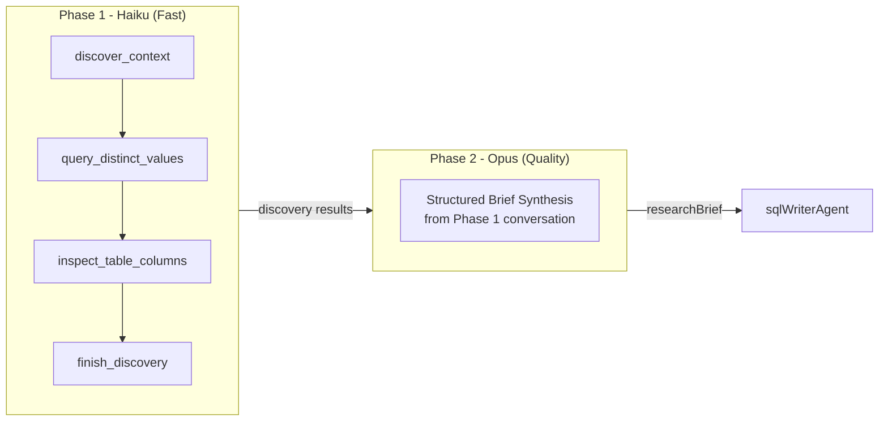

---

## 9. Knowledge Layer

All knowledge is pre-loaded as JSON at server startup for deterministic, fast lookups (no runtime DB queries for knowledge).

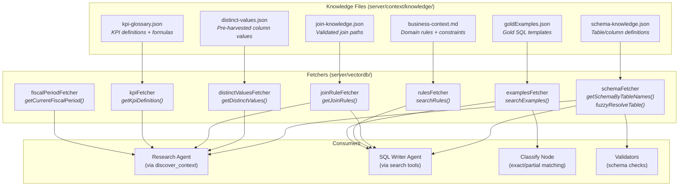

**Startup loading:** All fetchers are initialized in parallel via `Promise.allSettled` in `server/index.js`. Server starts even if some loaders fail (graceful degradation).

---

## 10. SSE Streaming Architecture

The primary client-server communication channel uses Server-Sent Events for real-time progress updates.

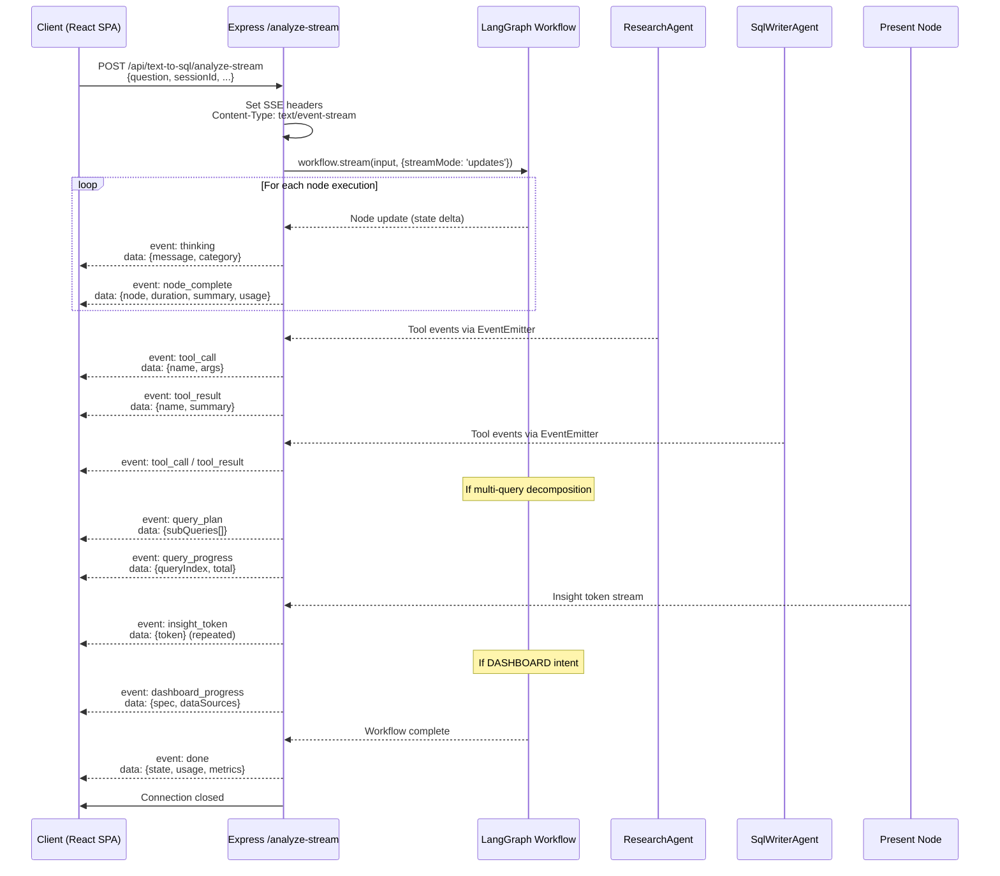

**SSE Event Types:**

| Event | Source | Description |
|-------|--------|-------------|
| `thinking` | All nodes | Human-readable progress message |
| `tool_call` | researchAgent, sqlWriterAgent | Agent invokes a tool |
| `tool_result` | researchAgent, sqlWriterAgent | Tool returns result |
| `node_complete` | All nodes | Node finished (duration, model, usage) |
| `query_plan` | decompose | Sub-query plan after decomposition |
| `query_progress` | accumulateResult | Multi-query loop progress |
| `dashboard_progress` | dashboardAgent | Dashboard spec generation status |
| `insight_token` | present | Streaming insight text token-by-token |
| `done` | Workflow end | Final payload with all results + metrics |
| `error` | Any failure | Error message |

**Event wiring:** Each agent node has its own `EventEmitter` instance (`researchToolEvents`, `writerToolEvents`, `presentEvents`, `decomposeEvents`, `accumulateEvents`, `parallelPipelineEvents`, `dashboardEvents`). The SSE route handler subscribes to all emitters and writes events to the HTTP response.

---

## 11. Authentication Flow

Okta OAuth 2.0 with PKCE flow. No client-side JWT — relies on HTTP-only session cookies.

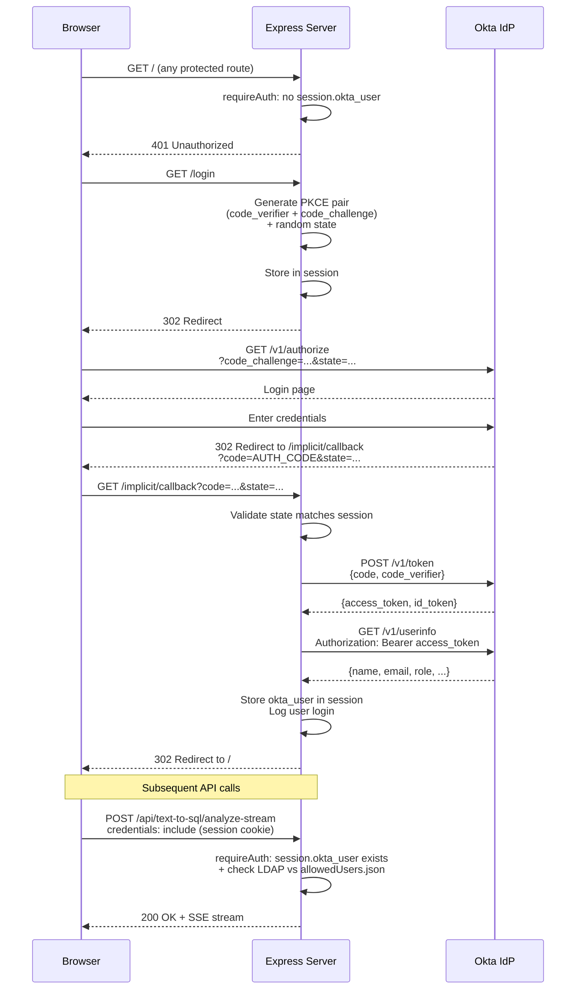

**Public paths (no auth required):** `/api/health`, `/login`, `/logout`, `/implicit/callback`, `/api/auth/me`

---

## 12. Client Component Hierarchy

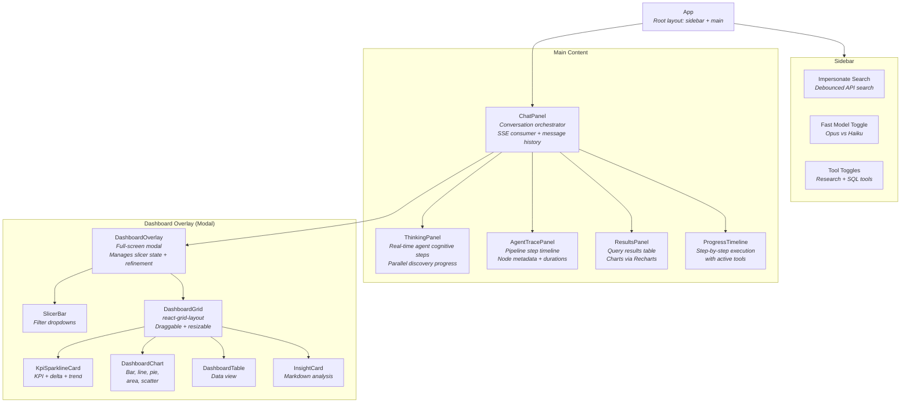

**State management:** React hooks + localStorage persistence (no Redux/Zustand). Session ID and message history persisted across page reloads.

**Key dependencies:** React 19, Recharts 3.7, react-grid-layout 2.2, Tailwind CSS 4.2, react-markdown 10.1

---

## 13. LLM Model Routing

Different pipeline nodes use different Claude models based on quality vs speed requirements.

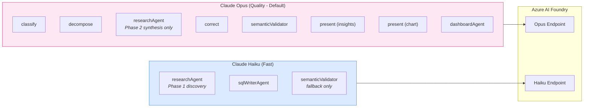

**Cost rates (per 1M tokens):**

| Token Type | Cost |
|------------|------|
| Input | $15.00 |
| Cached Input | $1.875 |
| Output | $75.00 |

**Per-request tracking:** Every LLM call records `promptTokens`, `outputTokens`, `cachedInputTokens` by node and model profile. Final response includes `usageByNodeAndModel` breakdown.

---

## 14. Workflow State Schema

The `WorkflowState` (defined in `server/graph/state.js`) uses LangGraph's `Annotation` API with 40+ channels grouped by function.

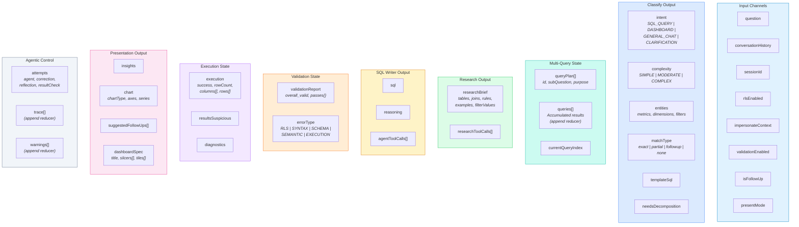

**Reducer behavior:**
- Most channels: **last-write-wins** — `(prev, next) => next`
- `queries`: **append** — `(prev, next) => [...prev, ...next]`
- `trace`: **append** — accumulates all node execution events
- `warnings`: **append** — accumulates all warnings

---

## Directory Structure

```
Auto_Agents_Claude/
├── server/
│   ├── index.js                          # Express entry point, middleware, startup
│   ├── config/
│   │   ├── llm.js                        # Model routing, token tracking
│   │   ├── database.js                   # SQL Server connection pool
│   │   └── constants.js                  # Tuning parameters (timeouts, retries)
│   ├── auth/
│   │   ├── requireAuth.js                # Okta session + LDAP middleware
│   │   ├── pkce.js                       # PKCE pair generation
│   │   └── logUserLogin.js               # Login event logging
│   ├── routes/
│   │   ├── textToSql.js                  # /api/text-to-sql/* (SSE + batch)
│   │   ├── auth.js                       # /login, /logout, /callback
│   │   ├── health.js                     # /api/health
│   │   └── impersonate.js                # /api/impersonate/search
│   ├── graph/
│   │   ├── workflow.js                   # StateGraph definition + routing
│   │   ├── state.js                      # WorkflowState channels
│   │   └── nodes/
│   │       ├── classify.js               # Intent classification
│   │       ├── decompose.js              # Multi-query decomposition
│   │       ├── alignSubQueriesToTemplates.js
│   │       ├── parallelSubQueryPipeline.js
│   │       ├── subQueryMatch.js
│   │       ├── researchAgent.js          # ReAct research agent
│   │       ├── sqlWriterAgent.js         # ReAct SQL generation agent
│   │       ├── injectRls.js              # RLS filter injection
│   │       ├── validate.js               # 4-pass validation orchestration
│   │       ├── correct.js                # LLM SQL correction
│   │       ├── execute.js                # SQL execution
│   │       ├── checkResults.js           # Result quality checks
│   │       ├── diagnoseEmptyResults.js   # Empty result diagnosis
│   │       ├── accumulateResult.js       # Multi-query accumulation
│   │       ├── present.js                # Insights + chart generation
│   │       └── dashboardAgent.js         # Dashboard tile spec
│   ├── tools/                            # Agent tool implementations (20+)
│   ├── validation/
│   │   ├── validator.js                  # Validation orchestrator
│   │   ├── rlsValidator.js               # RLS filter check
│   │   ├── syntaxValidator.js            # PARSEONLY dry-run
│   │   ├── schemaValidator.js            # Column/table check
│   │   └── semanticValidator.js          # LLM logic review
│   ├── vectordb/                         # Knowledge fetchers
│   ├── context/knowledge/                # JSON knowledge files
│   ├── services/queryExecutor.js         # SQL execution + safety
│   ├── utils/                            # Logger, metrics, RLS injector
│   └── tests/                            # Node --test suite
├── client/
│   ├── src/
│   │   ├── main.jsx                      # React entry point
│   │   ├── App.jsx                       # Root layout (sidebar + chat)
│   │   ├── components/
│   │   │   ├── ChatPanel.jsx             # Conversation orchestrator
│   │   │   ├── ThinkingPanel.jsx         # Agent thinking display
│   │   │   ├── AgentTracePanel.jsx       # Pipeline timeline
│   │   │   ├── ResultsPanel.jsx          # Query results + charts
│   │   │   ├── ProgressTimeline.jsx      # Execution steps
│   │   │   ├── DashboardOverlay.jsx      # Dashboard modal
│   │   │   ├── DashboardGrid.jsx         # Responsive tile grid
│   │   │   ├── SlicerBar.jsx             # Filter dropdowns
│   │   │   └── dashboard/
│   │   │       ├── KpiSparklineCard.jsx
│   │   │       ├── DashboardChart.jsx
│   │   │       ├── DashboardTable.jsx
│   │   │       └── InsightCard.jsx
│   │   └── utils/api.js                  # HTTP client + SSE streaming
│   ├── vite.config.js                    # Dev proxy to Express
│   └── index.html
└── CLAUDE.md                             # Project instructions
```

---

## Key Configuration Constants

| Constant | Value | Location |
|----------|-------|----------|
| `MAX_CORRECTION_ROUNDS` | 3 | `constants.js` |
| `PARALLEL_CORRECTION_ROUNDS` | 1 | `constants.js` |
| `MAX_RESULT_RETRIES` | 2 | `constants.js` |
| `MAX_SUB_QUERIES` | 4 | `constants.js` |
| `SUB_QUERY_MATCH_THRESHOLD` | 0.4 | `constants.js` |
| `QUERY_RESULT_ROW_LIMIT` | 1000 | `constants.js` |
| `SQL_AGENT_TIMEOUT_MS` | 180,000 (3 min) | `constants.js` |
| `SQL_AGENT_TIMEOUT_COMPLEX_MS` | 300,000 (5 min) | `constants.js` |
| `SQL_AGENT_MAX_ITERATIONS` | 15 | `constants.js` |
| `DB_REQUEST_TIMEOUT` | 60,000 (1 min) | `constants.js` |
| `DB_POOL_MAX` | 10 | `constants.js` |
| `DEFAULT_PORT` | 5000 | `constants.js` |
